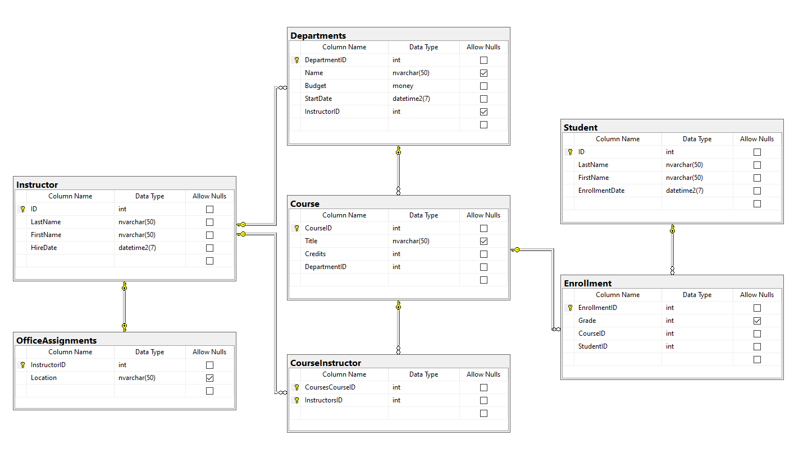
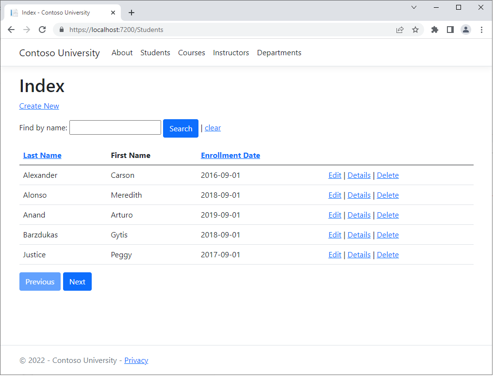
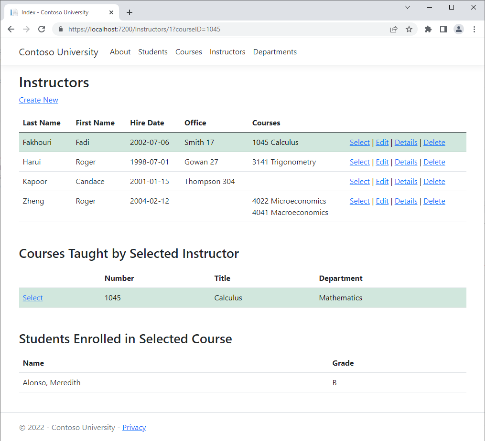

# Contoso University

This project is the result of following the 8 part tutorial ASP.NET Razor Pages with EF tutorial on the MSDN website. The data model contains enough complexity to demonstrate the basic Entity Framework concepts:

### [1. Getting Started](https://docs.microsoft.com/en-us/aspnet/core/data/ef-rp/intro?view=aspnetcore-6.0&tabs=visual-studio)

Create an ASP.NET Website in Visual Studio, add in Entity Framework and scaffold 

### [2. Create, Read, Update and Delete](https://docs.microsoft.com/en-us/aspnet/core/data/ef-rp/crud?view=aspnetcore-6.0)

### [3. Sort, Filter and Page](https://docs.microsoft.com/en-us/aspnet/core/data/ef-rp/sort-filter-page?view=aspnetcore-6.0)

Update the students page to include sorting, filtering and pagination.

### [4. Migrations](https://docs.microsoft.com/en-us/aspnet/core/data/ef-rp/migrations?view=aspnetcore-6.0&tabs=visual-studio)

### [5. Create a Complex Data Model](https://docs.microsoft.com/en-us/aspnet/core/data/ef-rp/complex-data-model?view=aspnetcore-6.0&tabs=visual-studio)

### [6. Read Related Data](https://docs.microsoft.com/en-us/aspnet/core/data/ef-rp/read-related-data?view=aspnetcore-6.0&tabs=visual-studio)

### [7. Update Related data](https://docs.microsoft.com/en-us/aspnet/core/data/ef-rp/update-related-data?view=aspnetcore-6.0)

### [8. Handle Concurrency Conflicts](https://docs.microsoft.com/en-us/aspnet/core/data/ef-rp/concurrency?view=aspnetcore-6.0&tabs=visual-studio)